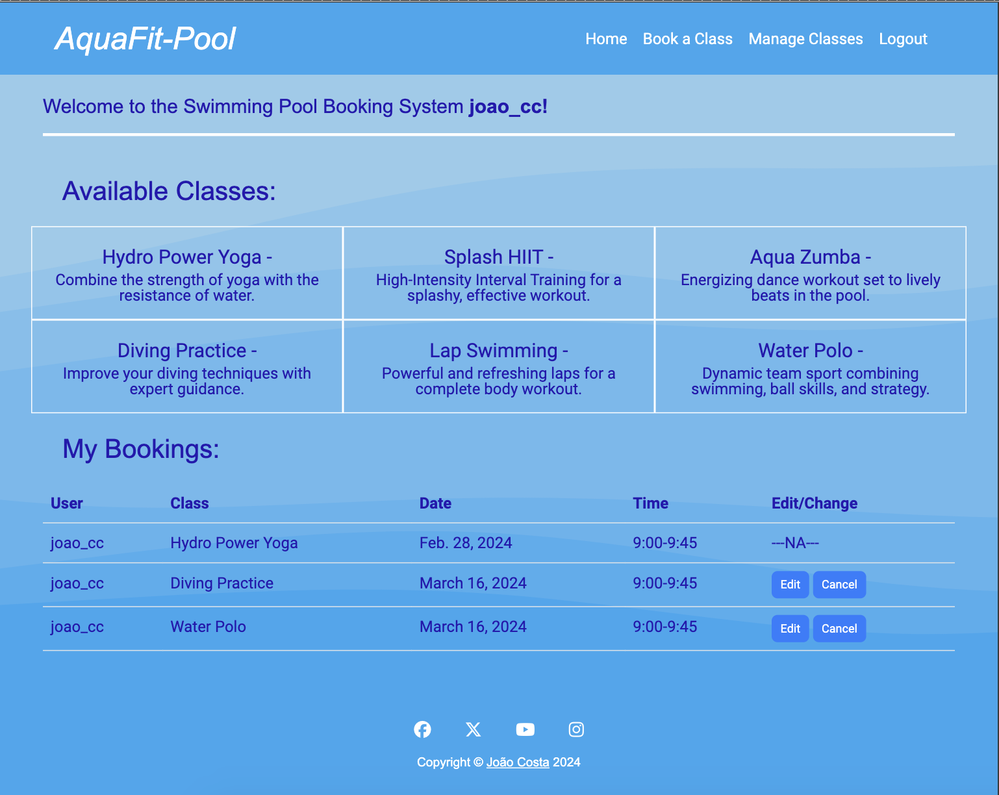

# AquaFit - Pool

## Features

Web application has the following pages:
- sign in page
- sign up page
- sign out page
- home page
- booking form page
- edit booking page
- cancel booking page
- manage classes page
- cancel class page

| Page Name     | User  | Staff member    |
| ------------- | ------------- | ------------- | 
| sign in page                  | Y | Y |
| sign up page                  | Y | Y | 
| sign out page                 | Y | Y |
| home page                     | Y | Y |
| booking form page             | Y | Y |
| edit booking page             | Y | Y |
| cancel booking page           | Y | Y | 
| manage classes page           | N | Y |
| cancel class page             | N | Y | 

- Each page has a navbar and a footer

**Navbar**

Navbar has the following links:
- home page
- Book a Class
- Manage Classes
- Logout/Login
- Register

The Pool logo on the left leads to the home page if pressed.

Note: Manage Classes only shows up as a staff member and Register at the sign in page

**Footer**

- Footer has the usual links for social media and the link the the creator's github profile

**Sign In page**

- In order for the user to understand what this page is about, there is a small description of the swiming pool and the features of the page.
- The Sign In page has the user name and the password the fill in.
- A Sign In button whci directs the user to the home page, if the credentials are correct.
- If you are new, there is a link for the sign up in the description
and the navbar opens up a register button that leads to the sign up page as well.

**Sign up page**

- This page asks for several fields to be filled upt for registration:
  - Username
  - Email (optional)
  - Password 
  - Password (again)

- A link for the sign in is provided on the top on order to go back to the sign in page if necessary.

**Sign out page**

- This page just shows a button to sign out wich directs the user to the Sign in page

**Home Page**

- This is the main page after signing in. 
- Here the user can:

  - Check the available Classes with a brief description
  - Check any bookings
  - Get buttons that link to Edit or Cancel classes pages. This feature is only available for future classes, not classes in the past

**Booking Form Page**

- This page shows you a form with several fields to fill in:
  - Selected class
  - Date
  - Time
  - Description

Note: all the fields need to be filled in properly in order for the for to be accepted.

 - Bellow the form there is a Book Now button to submit the form.

 **Edit Booking Page**

- This page shows you a form with several fields already filled in with the previous booking:
  - Selected class
  - Date
  - Time
  - Description

Note: all the fields need to be filled in properly in order for the for to be accepted.

 - Bellow the form there is a Save Changes button to submit the form.

 **Cancel Booking Page**

- This page shows a Cancel Booking button which will cancel the class and redirect to the home page if pressed

 **Manage Classes Page**

- This page is only visible for staff members!
- It shows:
  - All the available classes with a cancel button that links to the Cancel Class page
  - A table with all the bookings from every user from the day of visualisation (is does not show past bookings)
  - A form with the fields Class Name and Class Description to be filled in, followed by a Add Class button. If the button is pressed and the form properly filled in, a new class is added.

 **Cancel Class Page**

- This page is only visible for staff members!

- It shows two buttons:
  - A Yes, Delete button. If pressed the class is cancelled
  - A No, Go Back button. If pressed it links back to the manage classes page.

**Favicon**

  

  The favicon is a small image that is displayed in the browser's address bar. It is used to identify the website among others and help the user to find it when he/she is searching for it.

**Future features improvements**

 - Include EmailMultiAlternatives in order for the user to recive a message is a class has been deleted or a conforimation of the class booked or edited.

