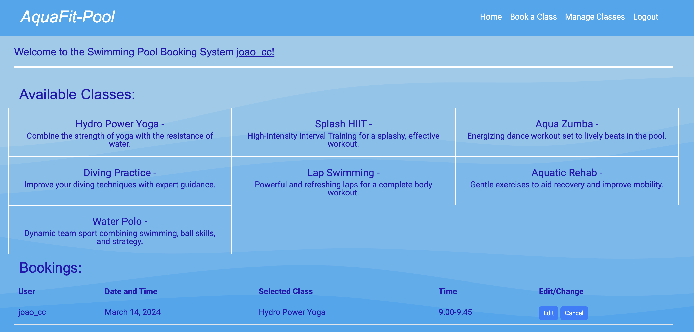

 # AquaFit - pool

Live Version: [AquaFit - pool](https://pool-bookin-system-c1efa7b0c18f.herokuapp.com/)

Repository: [GitHub Repo](https://github.com/Johns-Costa/pool-booking)

The app is developed by [João Costa](https://github.com/Johns-Costa).

## About

[AquaFit - pool](https://pool-bookin-system-c1efa7b0c18f.herokuapp.com/) is a swimming pool class booking and management application. The main goal of this app is to help the user book classes and the staff manage new and old classes.

## User Experience Design

### Strategy

Developed for everyone that wants to have some fun at a swimming pool. The app is designed to be easy to use and intuitive. The main goal of the app is to help anyone interested in having classes in the swiming pool to be able to book. the staff members can have it easy while adding new classes or deleting obsolete ones. This has the goal of increasing the efficiency of the pool management.

### Target Audience

The app was developed for eveyone who enjoys sports and water. 
  * Staff members: can add or telete classes. Check bookings, see users specific booking details and book classes for themselves.
  * Users: can book, edit and cancel classes. Either for themselves or for someone else (their kids for example).
  * User's familly or friends: can attend to classes can attend classes booked by a User.

