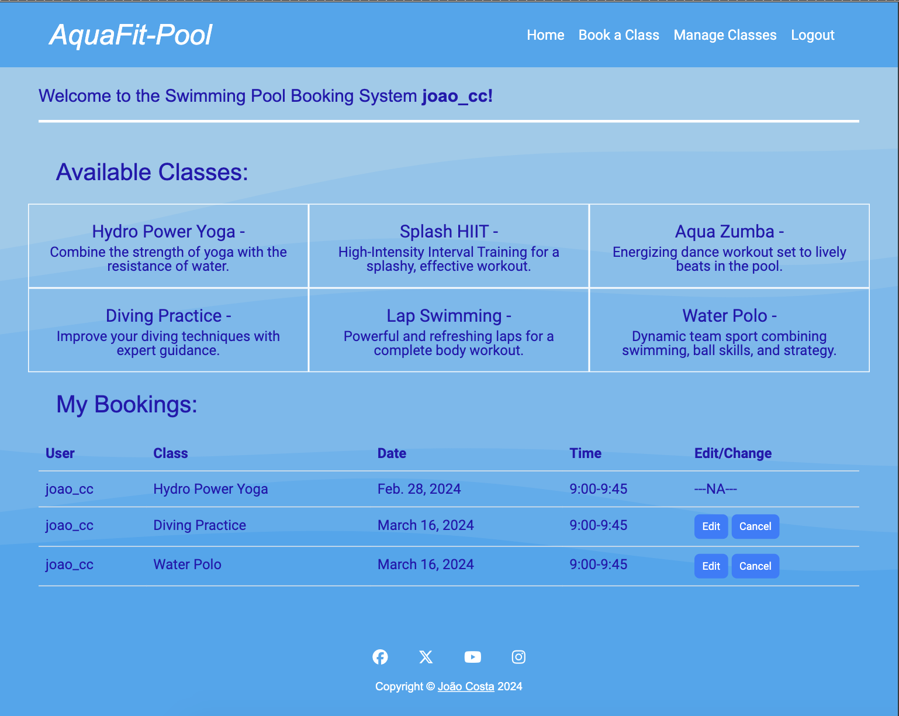
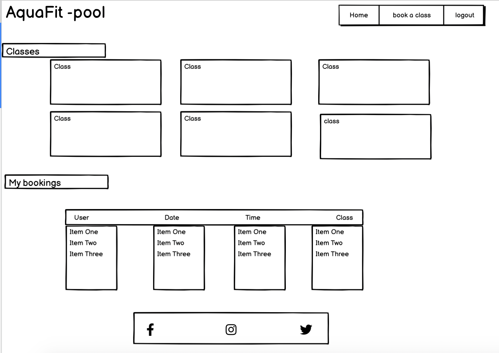
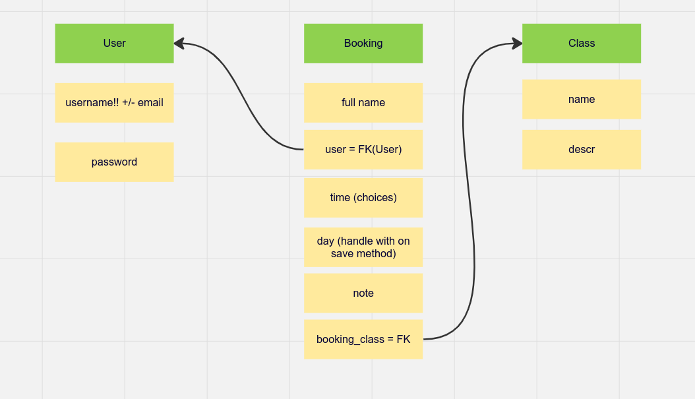

 # AquaFit - pool

Live Version: [AquaFit - pool](https://pool-bookin-system-c1efa7b0c18f.herokuapp.com/)


Repository: [GitHub Repo](https://github.com/Johns-Costa/pool-booking)

The app is developed by [João Costa](https://github.com/Johns-Costa).



## About

[AquaFit - pool](https://pool-bookin-system-c1efa7b0c18f.herokuapp.com/) is a swimming pool class booking and management application. The main goal of this app is to help the user book classes and the staff manage new and old classes.

## User Experience Design

### Strategy

Developed for everyone that wants to have some fun at a swimming pool. The app is designed to be easy to use and intuitive. The main goal of the app is to help anyone interested in having classes in the swiming pool to be able to book. the staff members can have it easy while adding new classes or deleting obsolete ones. This app has the goal of increasing the efficiency of the pool management.


### Target Audience

The app was developed for eveyone who enjoys sports and water. 
  * Staff members: can add or delete classes. Check bookings, see users specific booking details and book classes for themselves.
  * Users: can check their bookings, book, edit and cancel classes. Either for themselves or for someone else (their kids for example).
  * User's familly or friends: can attend to classes booked by a User.

### User Stories

#### **User**

| Issue ID    | User Story |
|-------------|-------------|
|[#1](https://github.com/Johns-Costa/pool-booking/issues/1)|As a user I can create an account so that can log in and manage my bookings|
|[#2](https://github.com/Johns-Costa/pool-booking/issues/2)|As a a user I can log in to my account so that I can access personalised features|
|[#3](https://github.com/Johns-Costa/pool-booking/issues/3)|As a user, I can have an overview of all the classes so that I can decide what to choose.|
|[#4](https://github.com/Johns-Costa/pool-booking/issues/4)|As a user, I can book a spot in a swimming pool class so that I can secure my attendance.|
|[#5](https://github.com/Johns-Costa/pool-booking/issues/5)|As a user, I can receive a confirmation message after booking a swimming pool class so that I know my booking was done|
|[#6](https://github.com/Johns-Costa/pool-booking/issues/6)|As a user, I can view my booked classes and their details so that I can keep track of my schedule.|
|[#7](https://github.com/Johns-Costa/pool-booking/issues/7)|As a user, I can cancel my booking if needed so that I can free up my spot and others can attend.|

#### **Admin**

| Issue ID    | User Story |
|-------------|-------------|
|[#8](https://github.com/Johns-Costa/pool-booking/issues/8)|As an admin, I can log in to the admin panel so that I can manage the swimming pool class system.|
|[#9](https://github.com/Johns-Costa/pool-booking/issues/9)|As an admin, I can add, edit, or delete swimming pool classes so that I can maintain an up-to-date class schedule.|
|[#10](https://github.com/Johns-Costa/pool-booking/issues/10)|As an admin, I can view a list of all booked classes and attendees so that I can manage class capacities.|

#### **Staff Member**

| Issue ID    | User Story |
|-------------|-------------|
|[#11](https://github.com/Johns-Costa/pool-booking/issues/11)|As a Staff Member I can add and delete classes so that the available classes correspond the what is available|

---

## Technologies used

- ### Languages:
    
    + [Python 3.12.1](https://www.python.org/downloads/release/python-3121/): the primary language used to develop the server-side of the website.
    + [JS](https://www.javascript.com/): the primary language used to develop interactive components of the website.
    + [HTML](https://developer.mozilla.org/en-US/docs/Web/HTML): the markup language used to create the website.
    + [CSS](https://developer.mozilla.org/en-US/docs/Web/css): the styling language used to style the website.

- ### Frameworks and libraries:

    + [Django](https://www.djangoproject.com/): python framework used to create all the logic.
    + [Bootstrap](https://getbootstrap.com/): Utilized for responsive design, providing a consistent look and feel across different devices.

- ### Databases:

    + [SQLite](https://www.sqlite.org/): was used as a development database.
    + [PostgreSQL](https://www.postgresql.org/): the database used to store all the data.

- ### Other tools:

    + [Git](https://git-scm.com/): the version control system used to manage the code.
    + [Pip3](https://pypi.org/project/pip/): the package manager used to install the dependencies.
    + [Gunicorn](https://gunicorn.org/): the webserver used to run the website.
    + [Psycopg2-binary](https://pypi.org/project/psycopg2/): the database driver used to connect to the database.
    + [Django-allauth](https://django-allauth.readthedocs.io/en/latest/): the authentication library used to create the user accounts.
    + [ElephantSQL](https://www.elephantsql.com/): the cloud database used to store all the data.
    + [GitHub](https://github.com/): used to host the website's source code.
    + [VSCode](https://code.visualstudio.com/): the IDE used to develop the website.
    + [Chrome DevTools](https://developer.chrome.com/docs/devtools/open/): was used to debug the website.
    + [Font Awesome](https://fontawesome.com/): was used to create the icons used in the website.
    + [Haikei](https://app.haikei.app/): was used to make a background image for the website using SVG.
    + [W3C Validator](https://validator.w3.org/): was used to validate HTML5 code for the website.
    + [W3C CSS validator](https://jigsaw.w3.org/css-validator/): was used to validate CSS code for the website.
    + [JShint](https://jshint.com/): was used to validate JS code for the website.
    + [PEP8](https://pep8.org/): was used to validate Python code for the website.


---

## FEATURES

Please refer to the [FEATURES.md](FEATURES.md) file for all features-related documentation.


---

### Wireframes




---

## Flowcharts

The following flowcharts was created to help to understand the application and its functionality.




---

## Information Architecture

### Database

* During the earliest stages of the project, the database was created using SQLite.
* The database was then migrated to PostgreSQL.

### Data Modeling

1. **Class**

Created in order for staff members to be able to make new classes available a delete obsolete ones

| Name          | Database Key  | Field Type    | Validation |
| ------------- | ------------- | ------------- | ---------- |
| Name      | name     | CharField     |  max_length=50, unique=True    |
| Description         | description         | TextField    | null=True   |
| Canceled    | canceled    | BooleanField     | default=False    |

8. **Booking**

Created to allow the booking of classes

| Name          | Database Key  | Field Type     | Validation |
| ------------- | ------------- | -------------- | ---------- |
| User          | user          | ForeignKey     | User,on_delete=models.CASCADE, null=True, blank=True           |
| Description   | description   | CharField      | max_length=50 |
| Date          | date_time     | DateField      |     |
| Time          | time          | IntegerField   | choices=TIME_PERIODS, default=0, validators=[validate_time_period] |
| Class         | selected_class| ForeignKey| Class, on_delete=models.CASCADE, null=True, blank=True |


```Python
    # Time periods variations
    TIME_PERIODS = (
        (0, '9:00-9:45'),
        (1, '10:00-10:45'),
        (2, '11:00-11:45'),
        (3, '14:00-14:45'),
        (4, '15:00-15:45'),
        (5, '16:00-16:45'),
        (6, '17:00-17:45'),
        (7, '18:00-18:45'),
    )
```

---
## Testing

Please refer to the [TESTING.md](TESTING.md) file for all test-related documentation.


---


## Deployment


- The app was deployed to [Heroku](https://www.heroku.com/).
- The database was deployed to [ElephantSQL](https://www.elephantsql.com/).

- The app can be reached by the [link](https://pool-bookin-system-c1efa7b0c18f.herokuapp.com/).

Please refer to the [DEPLOYMENT.md](DEPLOYMENT.md) file for all deployment-related documentation.

---

## Credits

- [GitHub](https://github.com/) for giving the idea of the project's design.
- [Django](https://www.djangoproject.com/) for the framework.
- [ElephantSQL](https://www.elephantsql.com/): for the free hosting of the database.
- [Font awesome](https://fontawesome.com/): for the free access to icons.
- [Heroku](https://www.heroku.com/): for the free hosting of the website.
- [Postgresql](https://www.postgresql.org/): for providing a free database.
- [Haikei](https://haikei.app/): for providing a free svg brackground images.


---

## Acknowledgments


- [Iuliia Konovalova](https://github.com/IuliiaKonovalova) my mentor, was of a great support. Helping me figure out and mature the idea for this project.
- My wife Luciana for all the support and keeping the family together.