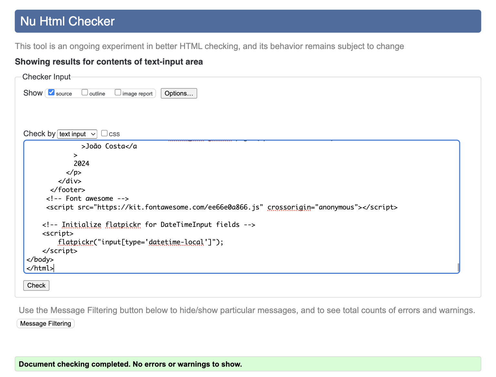
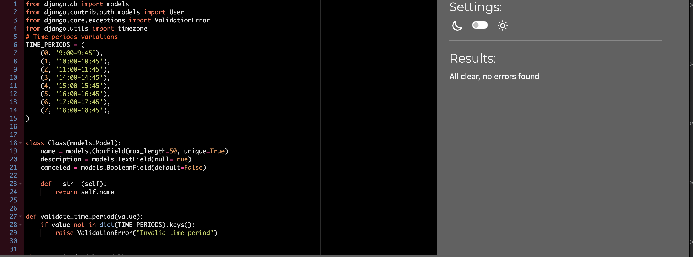

# Testing

## Manual Testing

Testing was done throughout site development.

Usability was tested with the below user acceptance testing, sent to new users to ensure testing from different users.

|     | User Actions           | Expected Results | Y/N | Comments    |
|-------------|------------------------|------------------|------|-------------|
| Sign Up     |                        |                  |      |             |
| 1           | Click on the sing in button | Redirection to sign in page | Y |          |
| 2           | Enter valid email | Field will only accept email address format | Y | Optional |
| 3           | Enter valid username | Field will only accept no more than 50 characters |
| 4           | Enter valid email | Field will only accept email address format | Y |          |
| 5           | Enter valid password | Field will only accept secure passwords | Y |          |
| 6           | Enter valid password confirmation | Field will only accept the same password from the previous field | Y |          |
| 7           | Click on the Sign Up button | Redirects user to home page, if form is accepted. User added | Y |          |
| Sign In     |                        |                  |      |             |
| 1           | Click on the Sign Up link in the form | Redirection to Sign Up page | Y |          |
| 2           | Enter valid username | Field will only accept valid user name | Y |          |
| 3           | Enter valid password | Field will only accept a correct password | Y |          |
| 4           | Click on the Sign In button | Takes user to home page, if form is accepted | Y |          |
| Navbar Menu |                        |                  |      |             |
| 1           | Click on the "hamburger" Menu button | Dropdown menu with 2-4 options depending if user or staff member | Y | Available to everyone |
| 2           | Click on "Home" | Redirection to Home page or Sign In page (if not signed in) | Y | Available to everyone |
| 3           | Click on "Book a Class" | Redirection to book a class page or Sign In page (if not signed in) | Y | Available to everyone |
| 4           | Click on "Manage Classes" | Redirection to Manage Classes page | Y | Available only to Staff members |
| 5           | Click on "Register" | Redirection to Sign up page | Y | Available to everyone. Only visible when not signed in |
| 6           | Click on "Login" | Redirection to Sign in page | Y |  Available to everyone. Only visible when not signed in |
| 7           | Click on "Logout" button | Takes user to Sign Out page to confirm logout | Y | Available to everyone |
| Home        |                        |                  |      |             |
| 1           | Click on "Edit" | Redirection to Edit Class page | Y | Only available for future classes, not for classes in the past |
| 2           | Click on "Cancel" | Redirection to Edit Class page | Y | Only available for future classes, not for classes in the past |
| Book a Class|                        |                  |      |             |
| 1           | Select a valid class | Field won't accept to be blank | Y |          |
| 2           | Enter Date | Field will only accept a date from today | Y |          |
| 3           | Select Time | Field will accept any time from the list | Y |          |
| 4           | Enter Description | Field will only accept no more than 50 characters and is mandatory | Y |          |
| 5           | Click on "Book Now" | Redirection to Book a Class page, if form accepted. Booking added | Y | A "Booking successful!" message Shows |
| Manage Classes |                        |                  |      |             |
| 1           | Enter Class Name | Field will only accept no more than 50 characters and is mandatory | Y |          |
| 2           | Enter Class Description | Field will only accept no more than 50 characters and is mandatory | Y |          |
| 3           | Click on "Add Class" | Redirection to Manage Classes page, if form accepted | Y | A "Class added successfully!" message Shows |
| 4           | Click on "Delete" | Redirection to Cancel Class page | Y |          |
| Sign Out    |                        |                  |      |             |
| 1           | Click on "Sign out" | Redirection to Sign in page | Y |          |
| Delete Class|                        |                  |      |             |
| 1           | Click on "Yes, Delete" | Redirection to Manage Classes page, Class deleted permanently | Y |  A "Class deleted successfully!" message Shows |
| 2           | Click on "No, Go Back" | Redirection to Manage Classes page | Y |          |
|Edit a Class |                        |                  |      |             |
| 1           | Select a valid class | Field won't accept to be blank | Y |          |
| 2           | Enter Date | Field will only accept a date from today | Y |          |
| 3           | Select Time | Field will accept any time from the list | Y |          |
| 4           | Enter Description | Field will only accept no more than 50 characters and is mandatory | Y |          |
| 5           | Click on "Book Now" | Redirection to Home page, if form accepted. Booking Edited | Y | A "Booking edited successfully!" message Shows |
|Cancel booking|                        |                  |      |             |
| 1           | Click on "Cancel Booking" | Redirection to home page, Booking deleted permanently | Y |  A "Booking deleted successfully!" message Shows |

---

## Validation:
### HTML Validation:

- No errors or warnings were found when passing through the official [W3C](https://validator.w3.org/) validator. This checking was done manually by copying the view page source code (Ctrl+U) and pasting it into the validator.

  - Booking Class
 
  - Cancel Booking
 
  - Class Class
 
  - Edit Booking
 
  - Home
 
  - Manage Classes
 
  - Sign in
 
  - Sign out
 
 

### CSS Validation:

- No errors or warnings were found when passing through the official [W3C (Jigsaw)](https://jigsaw.w3.org/css-validator/#validate_by_uri) validator except for the warnings about the use of css root variables and webkits for the box-shadow. However, css code works perfectly on various devices.

  - Style css
 

### Python Validation:

- No errors were found when the code was passed through [CI pep8 validator](https://pep8ci.herokuapp.com/) besides 3 lines in the settings.py that were too long. those were not possible to break. According to the reports, the code is [Pep 8-compliant](https://legacy.python.org/dev/peps/pep-0008/). This checking was done manually by copying python code and pasting it into the validator.

  - admin.py
 
  - apps.py
 
  - models.py
 
  - urls.py
 
  - views.py
 
  - asgi.py - pool
 
  - settings.py - pool
 
  - urls.py - pool 
 
  - wsgi.py - pool
 

### JS Validation:

- No JS validation was necessary on this project.

---

## Bugs

### Known bugs

There are no current known bugs

### Solved bugs

There were plenty of bugs during the development process since this project was a learning platform for me and allowed me to improve my skills and knowledge significantly.

However, I tried to solve the majority of them. One bug that took me a while to figure out was tat the index.html was constantly show messages besides the ones it was intented to. It turned out to be the if statement that was not written correctly.

---

## Lighthouse Report

### Home Page

### Booking form page

 

### Manage Classes Page

### Sign Up Page

### Sign In Page

 

### Sign out Page

 

### Cancel Booking Page

### Cancel Class Page

 

### Edit Booking Page

 

---

## Compatibility

Testing was conducted on the following browsers;

- Chrome;
- Safari;

---

## Responsiveness

The responsiveness was checked manually by using devtools (Chrome) throughout the whole development.

---